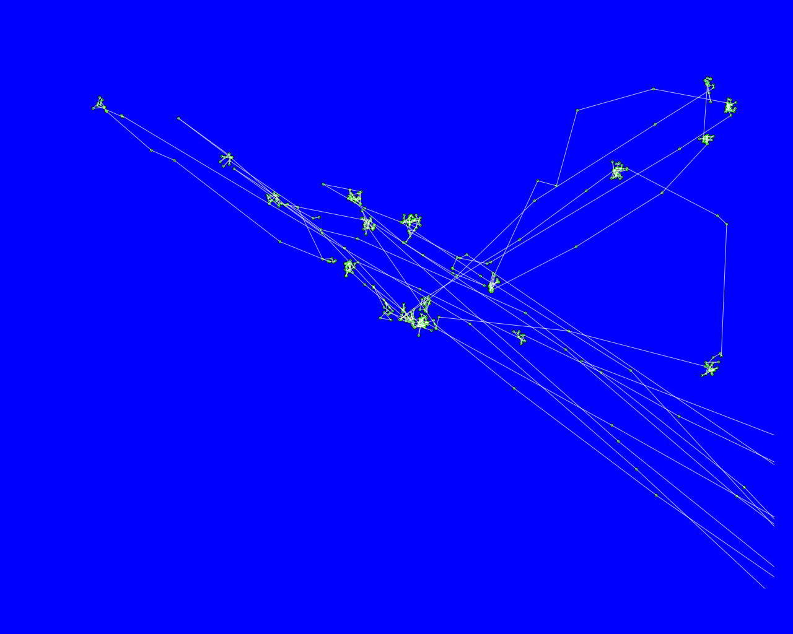

Tobii Eyetracker in R
=====================

Just a small test to plot the data exported by the tobii eyetracker in R

- Go to [r-project.org/](http://www.r-project.org/)  
- download and install R for your OS from one of the servers  

##Mac OSX  

Open a Terminal window and enter the follwing code (This creates an R envoirment file in your home directory)  

    echo "R_LIBS=/Users/$HOME/rLibrary" > $HOME/.Renviron

Creates a folder called "rLibrary" in your homefolder. All installed libraries will go there. Type:  

    mkdir ~/rLibrary  

###Start R.app from your Applications folder  
in the R console. Check your current working directory by entering:  

    getwd()  

The result should point to your home folder.  

####Set your working directory to somewhere where you can remember.
e.g the Desktop or whereever you cloned this repo.  

    setwd("/Users/[YOUR USER NAME]/Desktop/tobii-Eyetracker-R")  

Now you can place files in there and read them with R.  

Open the eyetracker.R with the R.app.  
Select the lines you want to execute  

select:  

    data <- read.table("tobii-CSVExport-All-Data-noheader-nofilter.tsv",sep="\t", header=TRUE)
    # plot(data$GazePointX,data$GazePointY, main="eyetracker", sub="",xlab="X-axis GazePointX", ylab="GazePointY", ylim=c(1024,0), xlim=c(0,1280))
    # png(filename="out.png", width = 1280, height = 1024,)
    par(bg = 'black')
    plot(data$GazePointX,data$GazePointY, sub="", xlab="", ylab="",axes=FALSE, ylim=c(1024,0), xlim=c(0,1280),col="black")
    points(data$GazePointX,data$GazePointY, col = "green", cex = .6)
    lines(data$GazePointX,data$GazePointY, col = "white")

hit cmd + enter. This should open a window with your plot that looks like this:  

  

Copyright (c)  2014 Fabian "fabiantheblind" Morón Zirfas  
Permission is hereby granted, free of charge, to any person obtaining a copy of this software and associated documentation files (the "Software"), to deal in the Software  without restriction, including without limitation the rights to use, copy, modify, merge, publish, distribute, sublicense, and/or sell copies of the Software, and to  permit persons to whom the Software is furnished to do so, subject to the following conditions:  
The above copyright notice and this permission notice shall be included in all copies or substantial portions of the Software.  
THE SOFTWARE IS PROVIDED "AS IS", WITHOUT WARRANTY OF ANY KIND, EXPRESS OR IMPLIED, INCLUDING BUT NOT LIMITED TO THE WARRANTIES OF MERCHANTABILITY, FITNESS FOR A  PARTICULAR PURPOSE AND NONINFRINGEMENT. IN NO EVENT SHALL THE AUTHORS OR COPYRIGHT HOLDERS BE LIABLE FOR ANY CLAIM, DAMAGES OR OTHER LIABILITY, WHETHER IN AN ACTION OF  CONTRACT, TORT OR OTHERWISE, ARISING FROM, OUT OF OR IN CONNECTION WITH THE SOFTWARE OR THE USE OR OTHER DEALINGS IN THE SOFTWARE.  

see also http://www.opensource.org/licenses/mit-license.php

